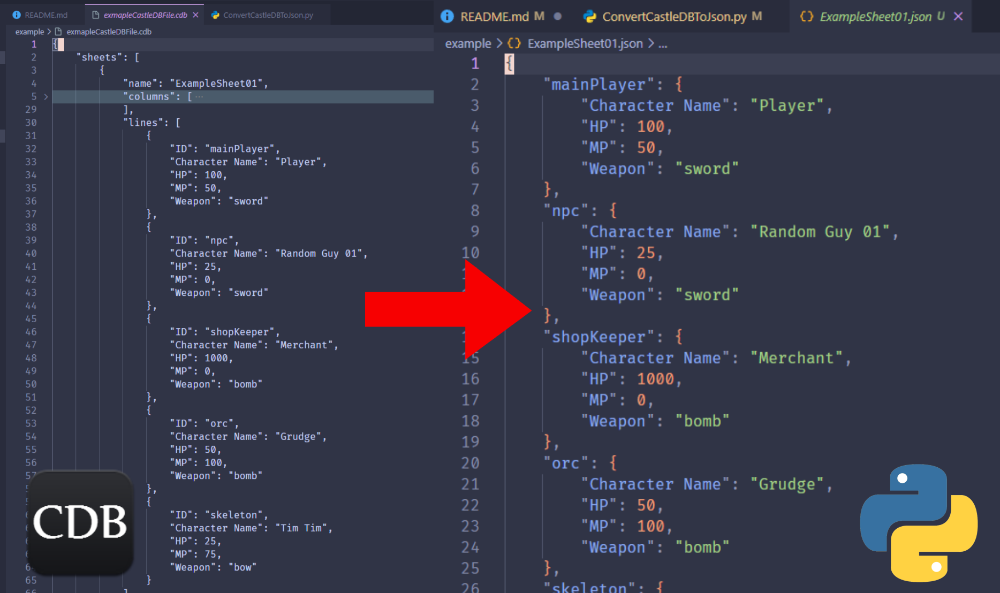

# CastleDB Cleaner
**CastleDB Cleaner** is a single file python script that converts *CastleDB* default `.cdb` files into a `JSON` file. *CastleDBs* `.cdb` file is *technically* a `json` file, however, the way it is stored leaves a lot to be desired, as it stores the values in an array form rather than a dictionary form. This script solves that by using one of the columns of the sheet to act as the custom ID. Each line of the sheet will be stored into a dictionary using that ID column as the key making it much easier and nicer to use. Each sheet is also stored as it's own file.

# Demo
Included is some demo files to mess with. There's a *CastleDB* file with 2 sheets and each sheet has a column labeled `ID`. Then there are two `JSON` files with the names of the sheets from the *CastleDB* file. As you can see, the ID inputed into the program has been taken to create a more typical dictionary format for each sheet, making it easier for use in other programs.

  
   

  
   

# Technical Details
This script uses pythons built-in `os` and `json` libraries.

You can keep up-to-date with bugs and future features in the `issues` tab.

> [!WARNING]  
> This has not been tested with CastleDBs tilemap system.

# Extra
- You can get it on [itchio](https://minoqi/itchi.io/castledb-cleaner) as well
- You can read my [blog post](https://minoqi.vercel.app/posts/castledb-to-json-converter/) which explains the code a bit

# License
Licensed under the MIT license, see `LICENSE` for more information.
